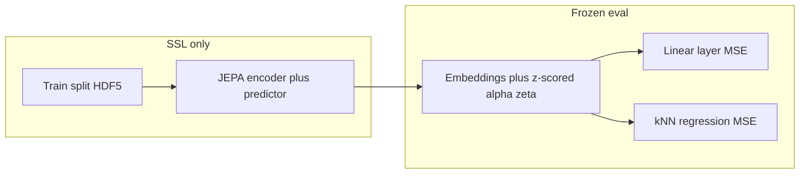
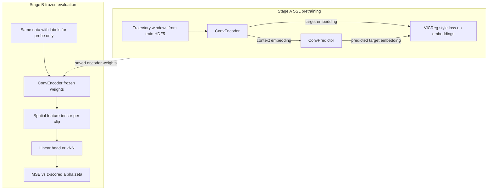
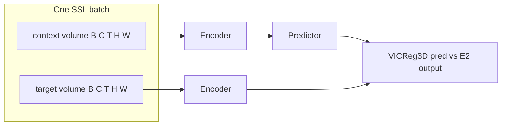
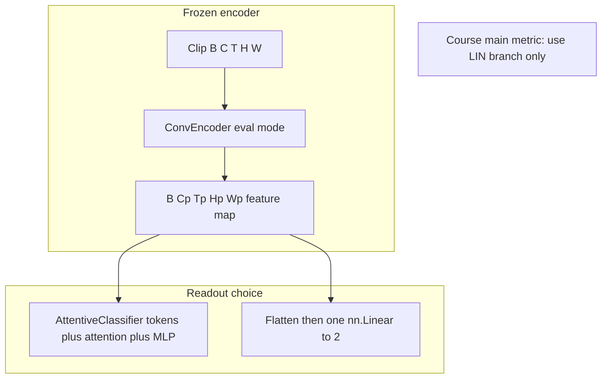

# Active Matter final project — implementation plan

## Context

Your workspace already matches the course’s **baseline paper/code** ([README.md](d:/physical-representation-learning/README.md)): JEPA pretraining, The Well–backed loaders in [physics_jepa/data.py](d:/physical-representation-learning/physics_jepa/data.py), and JEPA finetuning via [physics_jepa/finetuner.py](d:/physical-representation-learning/physics_jepa/finetuner.py). Pretraining is configured with `train.include_labels: false` in [configs/train_activematter_small.yaml](d:/physical-representation-learning/configs/train_activematter_small.yaml), which aligns with **not using α/ζ during SSL**.

You still need to **align evaluation with the syllabus** and **add kNN**, which the codebase does not implement today (only mentioned in [project description](d:/physical-representation-learning/project%20description)).

## Phase 0 — Data and environment

- Download `**polymathic-ai/active_matter`** (~52 GB) per the assignment; point `**THE_WELL_DATA_DIR**` at the local layout expected by `the_well` / this repo (see [scripts/env_setup.sh](d:/physical-representation-learning/scripts/env_setup.sh) and README).
- Install deps from [requirements.txt](d:/physical-representation-learning/requirements.txt); confirm GPU PyTorch.
- **Split discipline**: only **train** HDF5 for weight updates; **valid** for model selection / probe hyperparams (e.g. k, linear LR); **test** once at the end. Confirm loaders use the correct split names (`val` vs `valid` mapping is already handled in [physics_jepa/data.py](d:/physical-representation-learning/physics_jepa/data.py) for `WellDatasetForJEPA`).

## Phase 1 — Self-supervised pretraining (from scratch)

- Run JEPA pretraining via [scripts/active_matter/run_train_jepa.sh](d:/physical-representation-learning/scripts/active_matter/run_train_jepa.sh) with [configs/train_activematter_small.yaml](d:/physical-representation-learning/configs/train_activematter_small.yaml) (or overrides for epochs, noise, batch size within VRAM).
- **Course rules**: no pretrained weights; keep total params **< 100M** (use [physics_jepa/utils/model_summary.py](d:/physical-representation-learning/physics_jepa/utils/model_summary.py) or a one-liner count in logs).
- **HPC**: write checkpoints under scratch, `#SBATCH --requeue`, resume from latest checkpoint.

## Phase 2 — Frozen representation evaluation

### Linear probe (must match syllabus)

- The default active-matter finetune block sets `ft.use_attentive_pooling: true` in [configs/train_activematter_small.yaml](d:/physical-representation-learning/configs/train_activematter_small.yaml). The assignment **prohibits** attentive pooling (and MLP heads) for the **main** metrics.
- For **reported linear MSE**, override or fork config so `**use_attentive_pooling: false`** and `**head_type: linear**` (see [configs/ft/linear.yaml](d:/physical-representation-learning/configs/ft/linear.yaml)); keep `**ft.task: regression**` and MSE. Train **only the head** with encoder frozen (existing finetuner path with embeddings or frozen encoder—match whatever [physics_jepa/finetuner.py](d:/physical-representation-learning/physics_jepa/finetuner.py) already does for JEPA).
- Labels: use the same z-score normalization as the baseline (`normalize_labels` + `STATS` for `active_matter` in `finetuner.py`) so α and ζ are continuous targets, not 45-way classification.

### kNN regression (new work)

- **Implement a small eval script** (recommended: standalone Python using `sklearn.neighbors.KNeighborsRegressor`) that:
  - Loads **train-split embeddings + normalized labels** to fit kNN.
  - Evaluates on **val** and **test** embeddings with **MSE** on α and ζ (same normalization as linear probe).
  - Sweeps **k** (and optionally distance metric) **only on validation**; fixes chosen hyperparameters before touching test.
- **Embedding source**: reuse the finetuner’s embedding export path controlled by `ft.embeddings_dir` in [configs/ft/linear.yaml](d:/physical-representation-learning/configs/ft/linear.yaml), or add a thin “dump embeddings” mode if the current pipeline does not expose per-split `.npy`/HDF5 in one command—inspect `get_embeddings` / `EmbeddingsDataset` in [physics_jepa/finetuner.py](d:/physical-representation-learning/physics_jepa/finetuner.py) and wire splits explicitly for train/val/test.

## Phase 3 — Analysis and optional comparison baselines

- **Ablations** (for the report): masking ratio / noise / frame count / predictor depth; monitor representation collapse (e.g. covariance regularizers already in JEPA loss—interpret `sim_coeff`, `std_coeff`, `cov_coeff` in config).
- **Optional supervised upper bound** (report only): train end-to-end on labels if you add a separate experiment, clearly separated from SSL + frozen metrics—allowed as comparison, not as the graded main pipeline.

## Phase 4 — Deliverables

- **ICML-style report** (6–8 pages): method, linear + kNN tables (val + test), ablations, compute accounting (GPU type, hours, peak memory, mixed precision), limitations, contributions per member.
- **Submission bundle**: code, configs, **saved backbone**, logs, `ENV.md`, `requirements.txt`, one-command **reproduce** instructions (pretrain checkpoint path → linear probe → kNN script).
- **Reproducibility checklist** from the assignment: seeds, preprocessing doc, parameter count < 100M, no external data/weights.

## Key risks to address early

| Risk                                   | Mitigation                                                   |
| -------------------------------------- | ------------------------------------------------------------ |
| Attentive pooling in default FT config | Disable for official linear MSE numbers                      |
| No kNN in repo                         | Add sklearn-based eval on frozen embeddings                  |
| Spot preemption                        | Frequent checkpoints + `--requeue`                           |
| VRAM                                   | Reduce batch size / frames / model width; document tradeoffs |

---

## Baseline repo: architecture (for readers new to the code)

The repository implements **two separate stages** that must not be confused: **(A) self-supervised pretraining** learns the encoder from unlabeled spatiotemporal crops; **(B) frozen evaluation** uses that encoder only as a feature extractor and trains a tiny readout (or kNN) to predict normalized physical parameters. The course grades you on how good the encoder is after (A), measured by (B)—not on end-to-end supervised performance.

### Stage A — What “JEPA pretraining” means here (conceptual)

**Input.** Each training example is a pair of **consecutive time windows** from the same simulation clip: a **context** segment and a **target** segment (see indexing in [physics_jepa/data.py](d:/physical-representation-learning/physics_jepa/data.py): the dataset builds windows so the model sees `num_frames` frames as context and the next `num_frames` as target). Channels are the physical fields (11 for `active_matter`). The tensor layout used in training is `(B, C, T, H, W)` after the dataloader.

**Encoder.** [physics_jepa/utils/model_utils.py](d:/physical-representation-learning/physics_jepa/utils/model_utils.py) defines `ConvEncoder`: a **3D convolutional** hierarchy (Conv3d over time and space) with residual blocks. It maps the video-like volume to a **lower-resolution 3D feature map** (still has channel, time, height, width axes—think “semantic video feature volume”).

**Predictor.** `ConvPredictor` takes the **embedding of the context** produced by the encoder and tries to predict something that matches the **embedding of the future/target** segment. Intuitively: “given how the fields look now, what will the abstract representation of the near future look like?”

**Loss (not MSE on pixels).** [physics_jepa/model.py](d:/physical-representation-learning/physics_jepa/model.py) wires `vicreg_loss_3d`: the training signal compares **predicted** and **target** embeddings with a **VICReg-style** objective (similarity / variance / covariance terms; coefficients `sim_coeff`, `std_coeff`, `cov_coeff` in config). That encourages informative, non-collapsed latent features without using α or ζ.

**Training loop glue.** [physics_jepa/train_jepa.py](d:/physical-representation-learning/physics_jepa/train_jepa.py) defines `pred_fn`: run encoder on context and target, run predictor on context embedding, pass predictions and target embeddings into the loss. [physics_jepa/train.py](d:/physical-representation-learning/physics_jepa/train.py) `Trainer` handles optimization, scheduling, logging, checkpointing.

### Stage B — What “finetuning” means here (and why it is not end-to-end SSL)

In this codebase, **JEPA finetuning** ([physics_jepa/finetuner.py](d:/physical-representation-learning/physics_jepa/finetuner.py), `JepaFinetuner`) is **parameter prediction on top of a frozen encoder**:

1. **Load encoder** from your Stage A checkpoint (`load_model`).
2. **Freeze** all encoder parameters (`requires_grad = False`).
3. **Optional embedding cache:** `get_embeddings` runs the frozen encoder over train/validation data and writes HDF5 files (`embeddings`, `labels`) under `ft.embeddings_dir`. This avoids repeating heavy forward passes while training the readout.
4. **Train only the readout head** (`create_head`) with AdamW and MSE for `ft.task == "regression"`.

**Two readout designs exist in code:**

- `**use_attentive_pooling: true`**: spatial-temporal tokens go through `AttentiveClassifier` (attention + MLP inside). The course text **forbids** this class of head for the **official** linear-probe metric.
- `**use_attentive_pooling: false`** and `**head_type: linear**`: uses `RegressionHead`—a **single** `nn.Linear`. In this implementation the encoder output is flattened before the linear layer, so the “linear probe” is **one linear map from the full flattened feature map** to 2 outputs (α̂, ζ̂). That is still a **single linear layer** (not an MLP stack); it is the compliant setting.

**Important gap for the assignment:** embedding export in `get_embeddings` writes `**train` and `val`** HDF5 files. There is **no third `test` embeddings file** in that path. For official **test** kNN/linear numbers you must **extend** the pipeline (small code change or script) so **test** is never used for training the probe or tuning k, but **is** used once for final MSE.

---

## What must stay unchanged (integrity and grading constraints)

These are **policy and honesty constraints**, not “do not edit files” rules:

- **No pretrained weights** anywhere in the graded encoder path (no ImageNet, CLIP, VideoMAE init for the submission model). Loading a Stage A checkpoint **you trained** on `active_matter` is allowed.
- **No extra datasets**; only `active_matter` HDF5 layout from The Well / Hugging Face distribution.
- **No training signal from α, ζ during Stage A** (`train.include_labels` must remain `false` for SSL). Do not sneak labels into the SSL loss.
- **No use of the test split** for any learning, tuning, or unsupervised updates—only final reporting.
- **Total parameters < 100M** for the model you report (encoder + predictor during SSL; count honestly if you add modules).
- **Main evaluation:** frozen encoder + **single linear layer** readout and **kNN** readout, **MSE** on **z-scored continuous** α and ζ—not discrete classification, not backbone finetuning for the headline numbers.

You **may** change file contents as needed as long as the above remains true.

---

## What must be modified (to match the syllabus)

| Area                | Current baseline behavior                                                                                                                                | Why change                                                                             |
| ------------------- | -------------------------------------------------------------------------------------------------------------------------------------------------------- | -------------------------------------------------------------------------------------- |
| Finetune config     | [configs/train_activematter_small.yaml](d:/physical-representation-learning/configs/train_activematter_small.yaml) sets `ft.use_attentive_pooling: true` | Assignment prohibits attentive pooling for **main** linear metric                      |
| Evaluation coverage | No kNN implementation in repo                                                                                                                            | Assignment **requires** kNN MSE in addition to linear                                  |
| Test split          | Embedding pipeline emphasizes train/val HDF5                                                                                                             | Need a **test** embedding pass (or on-the-fly eval) for final test MSE without leakage |

---

## What can be modified (research freedom within strict limits)

Anything below is **allowed** if you stay inside the integrity box above:

- **SSL objective and architecture (Stage A):** You may replace JEPA+VICReg with another self-supervised method **trained from scratch** on the same data (e.g. masked reconstruction, contrastive), or **adapt** the existing encoder/predictor depth, widths, frame count, augmentation noise (`noise_std`), loss coefficients—as long as parameters stay under 100M and you do not use forbidden supervision during SSL.
- **Predictor design:** `ConvPredictor` width/depth (subject to VRAM and param cap).
- **Training schedule:** epochs, learning rate, batch size, warmup, gradient accumulation, distributed settings—operational choices.
- **Probe hyperparameters:** learning rate and epochs for the **linear head only** (head is tiny; still “linear probe”). For kNN: **k** and metric are standard to tune on **validation** only.
- **Analysis code:** any plotting, collapse metrics, correlation plots, PCA of embeddings—does not affect grading rules.
- **Optional comparison experiments:** fully supervised end-to-end model **only** as a **separate baseline** in the report, clearly labeled—not as a substitute for SSL + frozen metrics.

---

## Improvement ideas (mapped to constraints)

Each idea notes **which stage** it touches and **what to watch**.

1. **Compliant linear probe by config only (low risk).** Set `ft.use_attentive_pooling: false` and `ft.head_type: linear`. Re-run finetuning from cached or fresh embeddings. **Benefit:** satisfies rubric without new SSL. **Watch:** compare old attentive numbers only in appendix as “non-compliant upper bound” if you want narrative contrast.
2. **Stronger SSL without new labels (Stage A).** Tune `sim_coeff`, `std_coeff`, `cov_coeff` and `noise_std` to balance **predictive accuracy vs collapse prevention** (covariance term fights collapse). **Watch:** log std and cov terms; if representation collapses, probe MSE blows up even if SSL loss looks small.
3. **Temporal context vs memory (Stage A).** `dataset.num_frames` in config (e.g. 16) trades **longer dynamics** vs **VRAM**. **Watch:** baseline doc warns activations dominate memory; shrinking batch or frames may allow more stable training.
4. **Predictor capacity (Stage A).** Slightly larger predictor may help latent prediction without exploding encoder params. **Watch:** count **encoder+predictor** toward 100M; predictor is usually smaller than encoder but not free.
5. **Embedding quality for kNN (Stage B).** kNN is sensitive to **scale** and **dimensionality**. Options within rules: L2-normalize embedding vectors before kNN; tune `k` on val; try weighted neighbors. **Do not** add a trainable MLP before kNN for the official metric—that would be a different readout.
6. **Full-coverage embeddings (Stage B).** Default embedding pass may cap steps (`num_train_steps`). For kNN, **using all train embeddings** often helps. **Watch:** disk and time; still no test labels in fit.
7. **Alternative SSL method (large change, still allowed).** Implement a second training script that still outputs a frozen encoder for the same tensor shape, then reuse the same linear+kNN evaluation. **Watch:** engineering time; must still respect no-pretrain and single-dataset rules.
8. **Supervised upper bound (optional, report).** Train a model with labels end-to-end **in a separate codebase path** to contextualize how far SSL+linear is from ceiling. **Cannot** replace the required frozen evaluation.

---

## Scripts and files: what to create, what you can create, what you must not treat as official

### Should remain as-is unless you have a scientific reason (stable baseline)

- [scripts/active_matter/run_train_jepa.sh](d:/physical-representation-learning/scripts/active_matter/run_train_jepa.sh) — entrypoint pattern is fine; override via Hydra-style args as README describes.
- Core library layout under `physics_jepa/` — avoid renaming packages or breaking `pip install -e .` unless you update packaging.

### Should be modified in place or forked as a new YAML (recommended: new YAML)

- New file e.g. `configs/train_activematter_course_eval.yaml` copying the small config but with `**ft.use_attentive_pooling: false`** and any probe LR you want—keeps the original paper baseline reproducible while your submission config is explicit.

### New scripts or modules you **should** create (recommended)

| Deliverable                                      | Purpose                                                                                      | Why new                                             |
| ------------------------------------------------ | -------------------------------------------------------------------------------------------- | --------------------------------------------------- |
| `scripts/eval_knn_active_matter.py` (or similar) | Load train/val/test embeddings + labels, fit `KNeighborsRegressor`, tune k on val, print MSE | No kNN in repo; keeps sklearn logic isolated        |
| Optional `scripts/dump_embeddings_split.py`      | Write **test** split HDF5 mirroring train/val format                                         | Current `get_embeddings` path is train/val oriented |
| `ENV.md`                                         | Course deliverable                                                                           | Not in repo today                                   |

These scripts **do not** replace SSL training; they only consume **frozen** features.

### New scripts you **can** create (optional, analysis / team workflow)

- Slurm job templates with `--requeue`, checkpoint resume wrappers.
- Notebooks or scripts for W&B summarization, collapse plots, field visualizations.
- Small utilities to count parameters and assert < 100M before long runs.

### What you **must not** create or use as the **primary** graded pipeline

- Any script that **loads public pretrained weights** into the submission encoder or conflates test data into training or tuning.
- A “finetune” script that **unfreezes the encoder** and is presented as the **main** result—violates frozen-evaluation rule.
- A **kNN or linear probe that internally stacks multiple learned layers** (e.g. MLP embedding before kNN, or attentive pooler) for the **official** numbers.

### Gray area (allowed for analysis, not for headline metrics)

- **Attentive pooling head** or **RegressionMLP** in [physics_jepa/finetuner.py](d:/physical-representation-learning/physics_jepa/finetuner.py): fine for **exploration** or **appendix** comparison if clearly labeled **non-compliant** with the syllabus.

---

## Summary table: unchanged vs modified vs optional

| Category                           | Examples                                                                                                                      |
| ---------------------------------- | ----------------------------------------------------------------------------------------------------------------------------- |
| **Leave behaviorally unchanged**   | SSL does not consume α/ζ; no external data; no pretrained init; test held out                                                 |
| **Change required for compliance** | Disable attentive pooling for linear MSE; add kNN eval; add test embedding eval path                                          |
| **Optional research edits**        | JEPA hyperparameters, architecture within param cap, alternative SSL method, ablations, supervised comparison side experiment |

